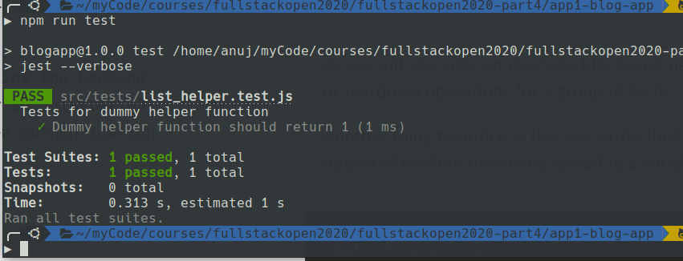
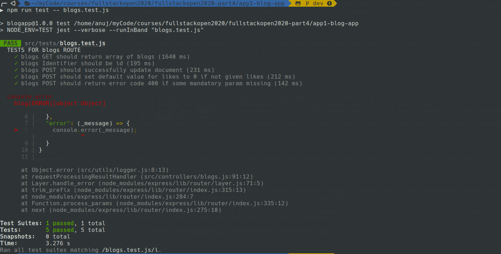

# Part 4

**Note:** For each part, I do not know beforehand how many different apps/projects I will have to make, and since there was no explicit warning telling me that I may have to deploy the code using this repository, I have decided to keep each distinct npm app in its own directory.

## Exercise 4.1

Copied the code as given in the exercise, structured it, installed the necessary packages, dev dependencies, etc. and got it working. Tested the one POST and one GET endpoint with Postman. It is connected to the same Atlas cluster as used in the last part but to a different database.

**NOTE:** When the exercise said "Turn the application into a functioning npm project", I assumed that I would have to structure it along the lines of what was shown in the course. Only later did I realize that structuring it was part of the second exercise. So I have inadvertenly completed 4.2 already.

## Exercise 4.2

I had inadvertently completed this in exercise 4.1, however, I have made some pretty significant changes to the request handlers of both the endpoints which I think requires some explaination.

Firstly, I switched it to async await. also, I learnt in Part 3 of the course that you could shift the error handling directly to a middleware. This got me thinking - any request would either do what it is supposed to successfully, or it would encounter some error, and in either case, it must respond. So, why not shift the entire responsibility of processing the result and responding accordingly to a middleware, be it some success result or an error result?

So, I initialized a `resultObj` at the beginning of each request handler, with 4 properties:

 - `success`: a flag denoting success or failure of as per the intended behaviour of the request
 - `error`: an object containing the error response, `null` if no error
 - `data`: an object containing the data to be sent in response (response body), `null` in case of error
 - `resCode`: the http status code to be used in the response

Other than this, the code itself should explain how it works. I know there can be holes and pitfalls with this approach, but I came up with it on the fly for the purpose of this exercise.

Apart from this, I have separated the `models` and `controllers` as per the MVC approach that this course is taking, set up a `dev` script which I ran to test this with Postman, and added a `lint` script as well using eslint.

**NOTE:** The course mentions "baby steps", each of which should be commits. If you wish to see these, there are about 10 or so commits before the actual submission commit, not all of them stable, which capture these. Will try to keep each commit stable from now on.

## Exercise 4.3

Added jest as a dev dependency, configured in `package.json` and `.eslintrc.js`, then added a directory `tests` in src. Then added the file `list_helper.js` in `utils`, added a function `dummy`, imported the same in the file `list_helpers.test.js` in the `tests` directory. Wrote a test in a `describe` block, and ran the same, via an npm test script, and it passed:

**NOTE:** The code isn't exactly the same as that in the course but it behaves in the same manner.

## Exercise 4.4

Wrote a simple totalLikes function that calculates the total likes with a simple reduce. Then made some mock arrays of json to test said function, hardcoded into the test.

My approach for writing the actual test, instead of explicitly writing the test case for each array of json, I thought of somehow putting all the test cases in an array and then calling the `test` (which it seems is essentially a function) block for each of the test cases (DRY principle). So, I came up with a way of defining a test case such that all the things needed to run the test case, excluding the function to be tested itself, are contained in the test case.

I defined the test cases as an array of objects, where each object would represent a test case, and would have the following properties:

 - `description`: The description or test name that is associated with the test.
 - `params`: An array of the exact parameters that have to pe passed to the function. The params can be defined as an array becasue the array can just be spread using the spread operator and can be passed to any function we please.
 - `assert`: A function that takes the function to be tested as a parameter, and performs the assertion on it with the same `params` mentioned in the test case object.

 With the test cases designed in this format, I could just iterate over the test cases and devfine a `test` block for each.

 Few of the advantages of this approach that I can think of:

  - Each `test` block need not be defined individually.
  - Since the `assert` function takes the function to be tested ("target" function) as a parameter, we can change out the function if whenever we want without changing the test cases. In fact, we can have two competing functions that do the same thing and test them both with the same test cases. This makes for better reusablilty.
  - A test for anything has two essential parts - *how* something is tested and *what* it is tested with. Each test case represents *what* it's tested with, which changes from test case to test case, and the test block itself represents *how* it's tested, which remains constant for all test cases. This can make for better testing because we are testing a function with several different test cases in the *same manner*, without writing the test block repeatedly. **Note:** Of course how each `assert` function is implemented represents the *how* as well, and I did this becasue some test cases need to be asserted differently (`toBeClose`, `not.toBe`, etc), but is still makes for better separation of the *what* and the *how*.
   

## Exercise 4.5

Wrote another one-liner reduce to get the entire object with the most likes, and wrote a `describe` block to test it.

There are a few changes that I've made, those being that I wanted to run the tests on the same lists of blogposts which formed the test cases of the `totalLikes` function, and I wanted to do this in a way that I could define the mock test lists once and use them in both the `describe` blocks (again, DRY principle).

To achieve this, I separated the lists as a global array of arrays and used the same by explicitly specifying which array of blogs I want to use for a certain test, for both the describe blocks. This might help me in the exercises to come. 

## Exercise 4.6

I could've used lodash but decided not to, did it myself using a `Map` and a reduce function. For the tests, I had to change the names of the mock authors, so, made those changes (had to make the changes in the previous test as well due to this, but only in the data). All tests pass.

## Exercise 4.7

Used an almost identical function as the last one to calculate most likes, with some subtle differences, of course. Wrote tests for the same, and in the last few exercises is where I think the reusability of the tests really shines.

## Exercise 4.8

First, I realized I hadn't structured my code properly for the API to be testable, so I structured it in a way that the express app itself was imported by the main `index.js` file. Then I wrote the test and wrote a [custom assertion](https://github.com/visionmedia/supertest#expectfunctionres-). I explicitly returned a promise in the callback of the `test` block because I read in the [Jest docs](https://jestjs.io/docs/en/api#testname-fn-timeout) that if a promise is returned then the `test` block will wait for the execution to complete. I know that `async` functions implicitly wrap a promise so I could've just delclared the callback `async`, but I like to keep things a bit explicit when confusing matters of asynchronous programming in JS are concerned.

## Exercise 4.9

I had already added the transform function in the model that changed the identifier to `id` from `_id`, so I just used the `toBeDefined()` assertion in jest as suggested by the course to check if `id` is defined and that `_id` is *not* defined.

## Exercise 4.10

Added the test, in which the following assertions were added:

 - There should be an `id` in the response of the POST endpoint and it should be a string.
 - After fetching the blogs via the GET endpoint, the response of the GET endpoint should be an array.
 - There should be an object in this array which has an `id` that matches the `id` of the new doc (which is the newly entered doc fetched from the DB).
 - This object should have an `id` field.
 - That `id` field should match the `id` returned by the POST request, ensuring that it is the same document that was updated.
 

## Exercise 4.11

Added the test, in a similar fasion to the previous test, ensures that likes is set to 0 when not given in payload.

## Exercise 4.12

Fortunately, I had already added this check in the POST endpoint, making all params except `likes` as mandatory params, with http status code 400 to be returned if they were missinig. All I had to do was to add the test, and it was done.

**NOTE:** Even though all tests are passing, there is an error logged. Since this error actually matches what I'm logging in the blogs POST endpoint itself, I'm assuming it's that and not some error that jest itself is giving me:

## Exercise 4.13

Added the functionality first, as an API endponint with path `/api/blogs/:id` then first verified via Postman. Added the tests after doing this. In the test to verify whether the correct document was being deleted, I first had to fetch the document (as I would not know what `id` any given document was going to have), and then delete the same document using its `id`.

## Exercise 4.14

Added the PUT endpint and wrote the tests for the same, ensuring that the document with the correct id is updated.

## Exercise 4.15

Added the user controller and model.

The user schema has the following properties as of now:

 - `username`: as mandated by the course.
 - `user_type`: this will decide which type of user it is, currently it is an enum of ADMIN and STD (standard user). Later, I will implement a middleware to ensure that only ADMIN users can make new users.
 - `name`: as mandated by the course.
 - `auth`: this will be an object that will contain the `hash`. I made it an object because in the future, we may want to expose the API for this blog app (say, to some hypothetical customer), so we can use this `auth` object to store the API key for that user as well. While fetching the users via API, we can simply drop the auth object out with a projection, so no sensitive information is sent in the API response.

 **NOTE:** I have not implemented token-based authorization yet, and from what I can see, that is coming up in a later exercise. 

## Exercise 4.16

I had already added most of these validations, just added the unique username validation at the mongoose level and wrote tests for this endpont covering a wide range of possibilities, should be self-explanatory.

## Exercise 4.17

Had I stored some properties of the blogs in users as an array of objects like shown in the course, in case of update of any property of a blog (say title, url, etc) I would have had to make changes to those properties in users as well as in the blog document, or store everything in one users collection and abandon the blogs collection altogether.

Instead, to model the one-to-many relationship between users and blogs, I decided to store the `_id` of the `user` in each `blog` as an `ObjectId`.

This would make for complex queries to fetch data in the GET routes, but the problem of inconsistencies will be resolved.

I could've made multiple queries and then joined the data in my code, but decided to use `$lookup` instead, which would be more performant. After inplementing the aggregations in users and blogs GET endopoints, I found that many of the tests were failing - primarily because the identifier property was `id` and the aggregation was returning `_id`. I found some easy way to do this, like a `transform` function for aggregation in mongoose (which I did not find) or any stage in the aggregation pipeline with which you could selectively map only some properties to a different keyname (which I found none), but ultimately I had to go with the obvious approach - `$project` stage in the pipeline. This was cumbersome, but it got the job done.

## Exercise 4.18

The statement of this exercise is a bit confusing - it asks to implement jwt-based validation, which involves making a login endpoint to first generate the token (which is clear) but the next exercise implies that the token validation must work only on certain endpoints, and this exercise isn't clear on which endpoints exactly we have to apply this on. Are we to not allow any user to view any blogs or users if not logged in?

Anyway, for the purpose of this exercise, I have simply made a `tokenValidator` middleware that parses a bearer jwt, if any and stores the user info thus obtained in the request object, in `req.user`.

**NOTE:** The token validation middleware will **not** return an error up until this point, if no jwt/incorrect jwt is supplied, as it's unclear which endpoints we want to protect.

## Exercise 4.19

Now that it was clear what I had to add the token validation for, I removed the `tokenValidator` middleware from `app.js`, modified it to respond with 401 if no valid token was received, and added it specifically to the blogs POST endpoint. I could add this middleware in whichever route/endpoint I wish.

Also, although it was not a requirement (I found this out later), the tests that all these changes break have been fixed with some trickery. Test coverage is not ideal though, as I haven't added more tests to cover some scenarios that these changes have introduced (for example, no valid token sent in blogs POST). 

## Exercise 4.20

I have done this inadvertently already, but a modified version - instead of putting the token in `req.token`, I have decoded it in the middleware and put the resulting user info in `req.user`, so I am considering this done.

## Exercise 4.21

Since I had token validation down to a middleware, all I had to do was to add the `tokenValidator` middleware to the blogs DELETE endpoint. Also, I added a check in the `findOneAndRemove` query in this endpoint - a filter of `userId: req.user.id` (since `req.user` contains the decoded user info from token). This alone would ensure that only the users whose `userId` was in the blogs (who therefore "owned" the blog in the one-to-many relationship) could delete it.

## Exercise 4.22

I had inadvertently done most of this already. To change the tests for delete, I did some of the more trickery that I did for the POST route wherein I would store the token with the delete parameters itself during the setup for the test in `beforeEach`. And writing the additional test where no token is sent was trivial.

---